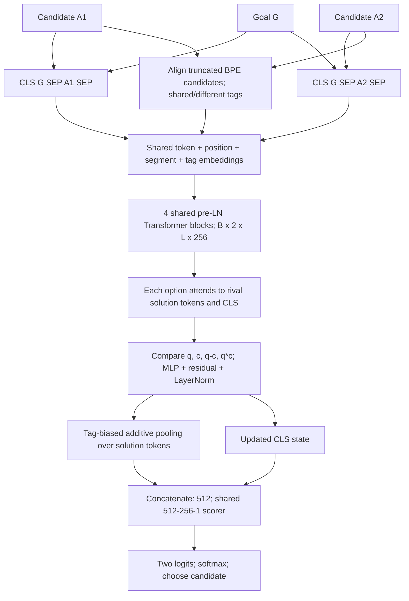

# Architecture and tensor flow

All neural weights are shared across options; batch flattening is [B,2,L] -> [2B,L] for encoding.
L <= 40+96+3=139, positional table capacity 160. Each attention module has four 64-dimensional heads.
Goal-candidate attention is joint self-attention inside the Transformer; rival attention is a separate step.
The optional MLM branch exits after the encoder, uses a tied vocabulary head and appears only during warm-up.

Use `figures/architecture.svg` for scalable report insertion and `figures/architecture.png` for a preview.
See methodology_equations.md for the exact affine maps, masks and losses.
